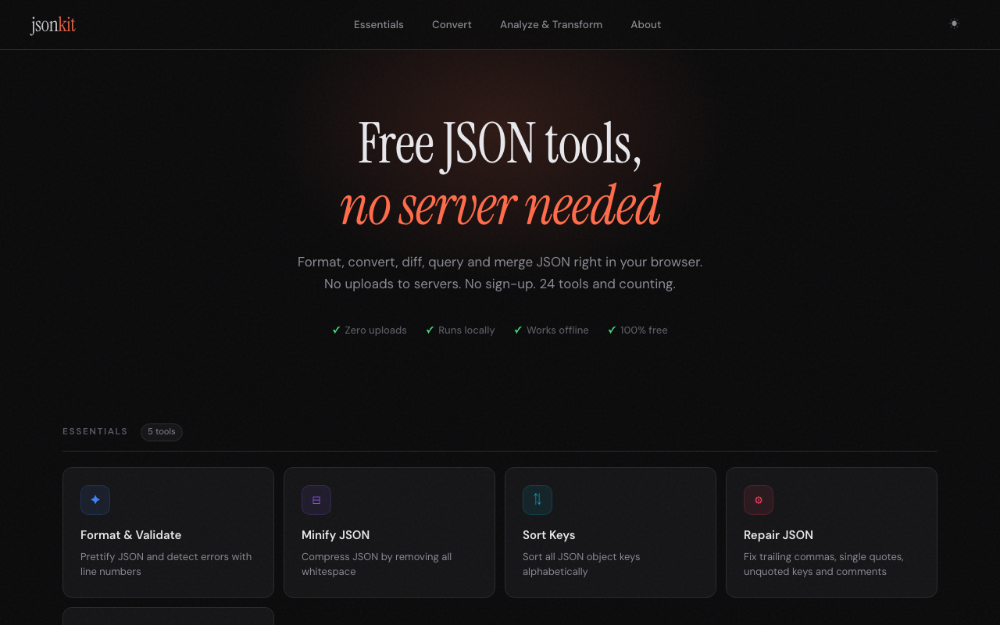

# jsonkit


Live site: https://viveknaskar.github.io/json-kit/

Free, open-source JSON tools that run entirely in your browser. No sign-up, no server uploads — your data never leaves your device.

Built with vanilla JavaScript and [Vite](https://vitejs.dev/).

---

## Screenshots

### Home



### Essentials

| Format & Validate | Minify JSON | Sort Keys |
|:---:|:---:|:---:|
|  |  |  |

| Repair JSON | Escape / Unescape |
|:---:|:---:|
|  |  |

### Convert

| JSON to CSV | CSV to JSON | JSON to YAML |
|:---:|:---:|:---:|
|  |  |  |

| YAML to JSON | JSON to XML | XML to JSON |
|:---:|:---:|:---:|
|  |  |  |

### Analyze & Transform

| JSON Merge | JSON Diff | Schema Validator |
|:---:|:---:|:---:|
|  |  |  |

| Flatten JSON | Unflatten JSON | JSON Query |
|:---:|:---:|:---:|
|  |  |  |

---

## Features

- **100% client-side:** all processing happens in the browser — no backend, no cloud
- **No data uploads:** JSON is parsed and transformed entirely in your browser tab
- **Works offline:** once loaded, every tool works without an internet connection
- **No sign-up, no limits, no watermarks**
- **17 tools** covering formatting, conversion, diffing, querying, and more

---

## How does it Work?

When you paste JSON into any tool, it never leaves your device. Here is exactly what happens:

1. **Your input is read into memory** inside the browser tab as a plain JavaScript string.
2. **All parsing and transformation runs locally** using pure JavaScript — no WebAssembly, no server calls.
3. **The result is written back to the page** as a string, still entirely in memory.
4. **If you download**, the browser generates a temporary local `Blob` URL, triggers the download, then immediately revokes it.
5. **When you close the tab**, everything is gone. No trace left anywhere.

No data is ever sent over the network. There is no backend, no database, and no cloud storage involved. You can turn off your WiFi after the page loads and every tool will still work.

---

## Tools

### Essentials

| Tool | Description |
|------|-------------|
| **Format & Validate** | Prettify JSON and detect parse errors with line and column info. |
| **Minify JSON** | Compress JSON by stripping all whitespace. Shows size reduction. |
| **Sort Keys** | Sort all object keys alphabetically, recursively through nested structures. |
| **Repair JSON** | Fix trailing commas, single quotes, unquoted keys, and inline comments. |
| **Escape / Unescape** | Escape a raw string for use inside a JSON value, or unescape it back. |

### Convert

| Tool | Description |
|------|-------------|
| **JSON to CSV** | Convert a JSON array to CSV. Headers are sorted; nested values are serialised. |
| **CSV to JSON** | Parse CSV (including quoted fields and CRLF) into a typed JSON array. |
| **JSON to YAML** | Hand-rolled YAML serialiser — no external library required. |
| **YAML to JSON** | Hand-rolled YAML parser — handles sequences, mappings, and all scalar types. |
| **JSON to XML** | Convert JSON to structured XML wrapped in `<root>`. Arrays repeat the parent tag. |
| **XML to JSON** | Parse XML back to JSON. Repeated siblings become arrays; text is type-coerced. |

### Analyze & Transform

| Tool | Description |
|------|-------------|
| **JSON Merge** | Deep merge two JSON objects. Choose between replace or concat array strategy. |
| **JSON Diff** | Deep-compare two JSON objects and highlight added, removed, and changed keys. |
| **Schema Validator** | Validate JSON against a JSON Schema definition (type, required, pattern, enum, allOf, anyOf, oneOf, not, if/then/else, and more). |
| **Flatten JSON** | Flatten nested objects to dot-notation keys (`a.b.c`, `arr[0]`). Configurable separator. |
| **Unflatten JSON** | Restore dot-notation flat keys back to a nested structure. |
| **JSON Query** | Extract values using path expressions (`users[0].name`, `items[*].id`). |

---

## Tech Stack

| Library | Role |
|---------|------|
| [Vite](https://vitejs.dev/) | Dev server, ES module bundler, and production build tool |
| [Vitest](https://vitest.dev/) | Unit test runner with happy-dom environment |

No frontend framework — plain HTML, CSS, and ES modules.

---

## Requirements

- [Node.js](https://nodejs.org/) v18 or later (v24 LTS recommended)
- npm (bundled with Node.js)

---

## Setup

```bash
# Install dependencies
npm install

# Start the dev server
npm run dev
```

Opens automatically at `http://localhost:3000/json-kit/`.

## Production Build

```bash
npm run build
```

Output goes to `dist/`. This is a fully static folder — deploy it anywhere.

```bash
# Preview the production build locally
npm run preview
```

---

## Testing

```bash
# Run all unit tests
npm test

# Watch mode
npm run test:watch
```

Tests use [Vitest](https://vitest.dev/) with happy-dom. Every exported pure function has unit tests — 316 tests across all 17 tools.

---

## Deploy

The project deploys automatically to GitHub Pages on every push to `main` via the GitHub Actions workflow at `.github/workflows/deploy.yml`.

To deploy manually:

```bash
npm run deploy
```

This runs `vite build` then pushes `dist/` to the `gh-pages` branch. The site is served from the base path `/json-kit/`, so the live URL is:

```
https://viveknaskar.github.io/json-kit/
```

---

## Project Structure

```
json-kit/
├── public/
│   ├── favicon.svg
│   ├── og-image.png
│   ├── robots.txt
│   └── screenshots/
├── src/
│   ├── styles/
│   │   ├── base.css          # CSS variables, dark theme, reset, animations
│   │   ├── layout.css        # Header, footer, hero, tool grid
│   │   ├── components.css    # Cards, buttons, toasts, tabs
│   │   └── tools.css         # Two-column editor layout, diff highlighting
│   ├── core/
│   │   ├── App.js            # App shell HTML, routing, navigation
│   │   └── Utils.js          # Shared utilities (clipboard, download, toast, stats)
│   ├── tools/
│   │   ├── FormatJson.js
│   │   ├── MinifyJson.js
│   │   ├── SortKeys.js
│   │   ├── RepairJson.js
│   │   ├── EscapeJson.js
│   │   ├── JsonToCsv.js
│   │   ├── CsvToJson.js
│   │   ├── JsonToYaml.js
│   │   ├── YamlToJson.js
│   │   ├── JsonToXml.js
│   │   ├── XmlToJson.js
│   │   ├── JsonMerge.js
│   │   ├── JsonDiff.js
│   │   ├── JsonSchema.js
│   │   ├── FlattenJson.js
│   │   ├── UnflattenJson.js
│   │   └── JsonQuery.js
│   └── main.js               # Entry point — imports CSS, boots App, calls init()
├── tests/
│   └── unit/
│       └── utils.test.js     # 316 unit tests covering all tool logic
├── index.html
├── package.json
├── vite.config.js
└── vitest.config.js
```

---

## Adding a New Tool

1. Create `src/tools/YourTool.js` and export an `init()` function that binds event listeners
2. Add the tool entry to the `tools` array in `src/core/App.js`
3. Add a `yourToolViewHTML()` method in `App.js` and call it inside `toolViewsHTML()`
4. Import and call `init()` in `src/main.js`

---

## License

[MIT](LICENSE)
